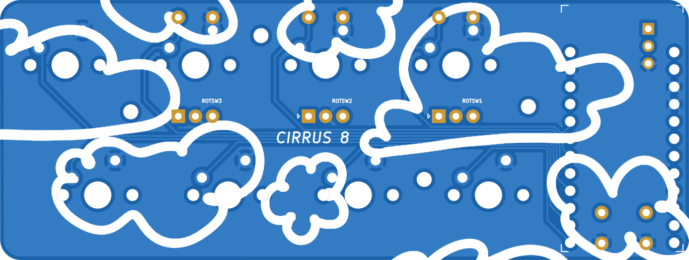
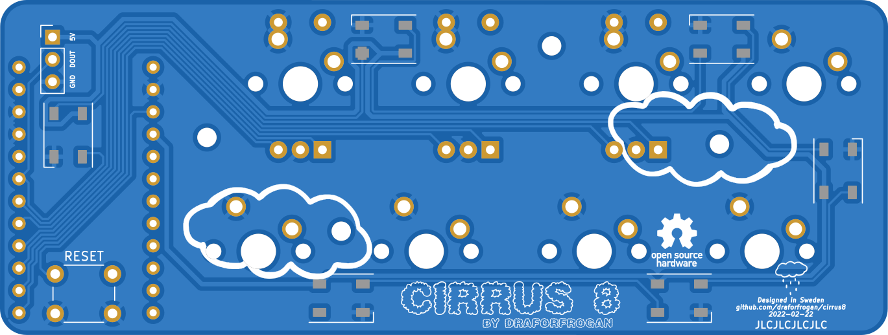

As 2021 was coming to an end, I started tinkering with KiCAD (EDA software), with the goal of creating a macro pad, for custom shortcuts in certain applications (and as I'm using a 75% keyboard, sometimes there are a few keys that would be neat to have during specific circumstances).

I've gone through several iterations since then, creating 5-6 different macro pads (Pro micro based, Atmega32u4 based, and finally Atmega328p based), as well as a 65% keyboard using only through hole components (but more on that later).

Cirrus 8 is a Pro Micro based macropad, that supports up to 8 keys, as well as 3 rotary encoders. Why would anyone need 3 rotary encoders you might ask? That's a good question that I hope to publish some use cases with at a later date.

#### Top PCB

#### Bottom PCB

